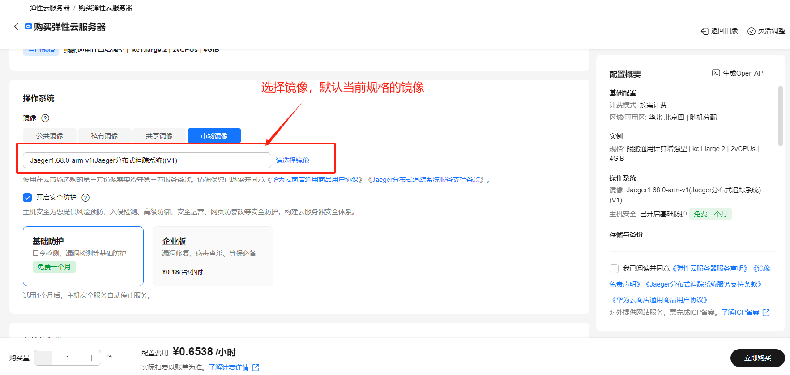
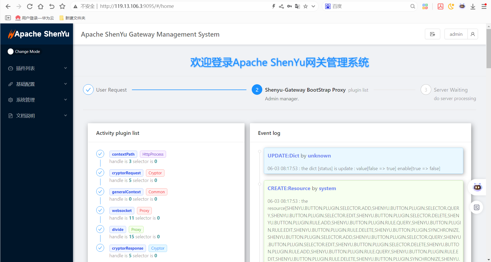
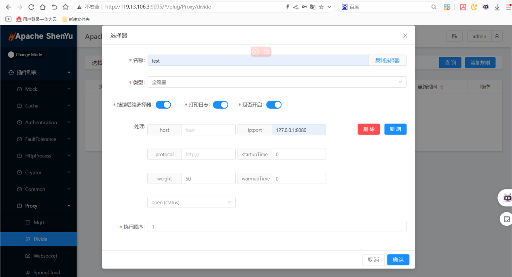
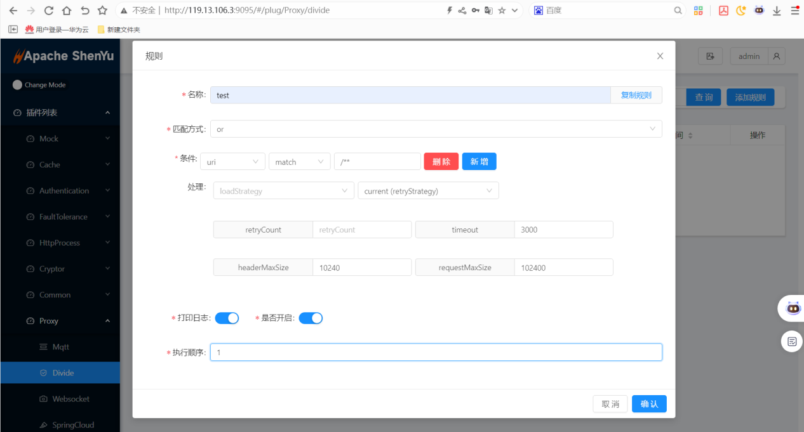
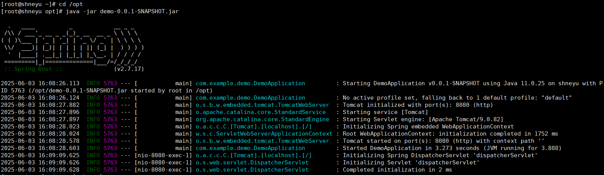
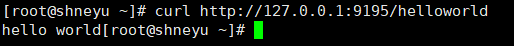

# shenyu网关使用指南

# 一、商品链接

[shenyu网关](https://marketplace.huaweicloud.com/contents/564d306e-87f0-4ba3-b4b4-5dd57a915468#productid=OFFI1141938203605426176)

# 二、商品说明

Apache shenyu 这是一个异步的，高性能的，跨语言的，响应式的 API 网关。该产品基于鲲鹏服务器和华为云 EulerOS 2.0 64bit 系统，提供开箱即用的shenyu网关。

# 三、商品购买
您可以在云商店搜索 **shenyu网关**。

其中，地域、规格、推荐配置使用默认，购买方式根据您的需求选择按需/按月/按年，短期使用推荐按需，长期使用推荐按月/按年，确认配置后点击“立即购买”。


## 3.1 使用 RFS 模板直接部署

必填项填写后，点击 下一步


创建直接计划后，点击 确定


点击部署，执行计划

如下图“Apply required resource success. ”即为资源创建完成

# 3.2ECS 控制台配置

### 准备工作

在使用ECS控制台配置前，需要您提前配置好 **安全组规则**。

> **安全组规则的配置如下：**
- 入方向规则放通端口8080,9095,9195，源地址内必须包含您的客户端ip，否则无法访问
- 入方向规则放通 CloudShell 连接实例使用的端口 `22`，以便在控制台登录调试
- 出方向规则一键放通

### 创建ECS

前提工作准备好后，选择 ECS 控制台配置跳转到[购买ECS](https://support.huaweicloud.com/qs-ecs/ecs_01_0103.html) 页面，ECS 资源的配置如下图所示：

选择CPU架构

选择服务器规格

选择镜像

其他参数根据实际请客进行填写，填写完成之后，点击立即购买即可


> **值得注意的是：**
> - VPC 您可以自行创建
> - 安全组选择 [**准备工作**](#准备工作) 中配置的安全组；
> - 弹性公网IP选择现在购买，推荐选择“按流量计费”，带宽大小可设置为5Mbit/s；
> - 高级配置需要在高级选项支持注入自定义数据，所以登录凭证不能选择“密码”，选择创建后设置；
> - 其余默认或按规则填写即可。

# 商品使用

## Shenyu网关使用

### 启动服务

```bash
bash /opt/apache-shenyu-2.5.1-admin-bin/bin/start.sh

bash /opt/apache-shenyu-2.5.1-bootstrap-bin/bin/start.sh
```

### 验证部署结果

浏览器访问http://ip+9095访问Apache Shenyu管理控制台：

默认用户名/密码:admin/123456




### 配置路由规则
插件列表-->proxy-->Divide,添加选择器


添加规则


运行提供的示例Java程序：
```bash
cd /opt
java -jar demo-0.0.1-SNAPSHOT.jar
```


代理请求 ：curl http://127.0.0.1:9195/helloworld



### 参考文档
[shenyu官方文档](https://shenyu.incubator.apache.org/zh/docs/index)
